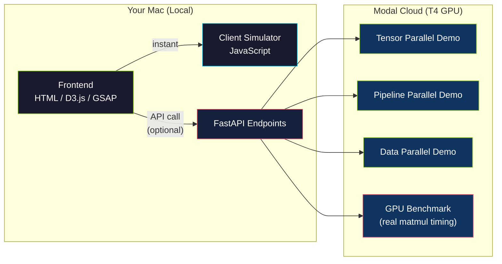
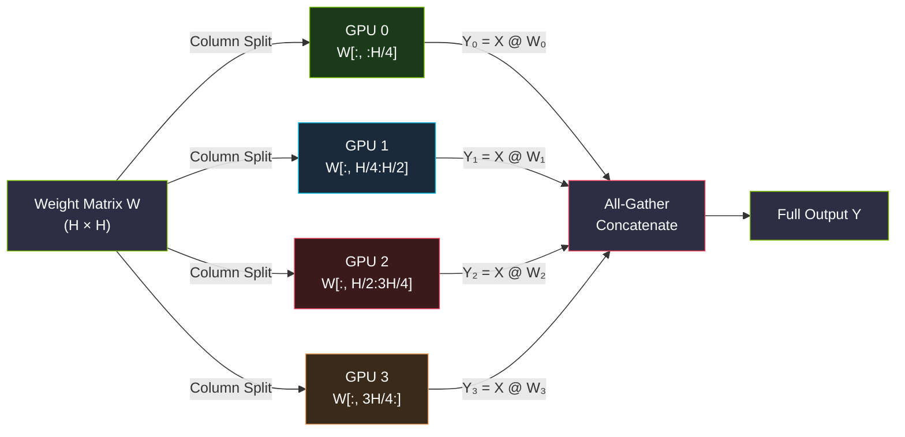
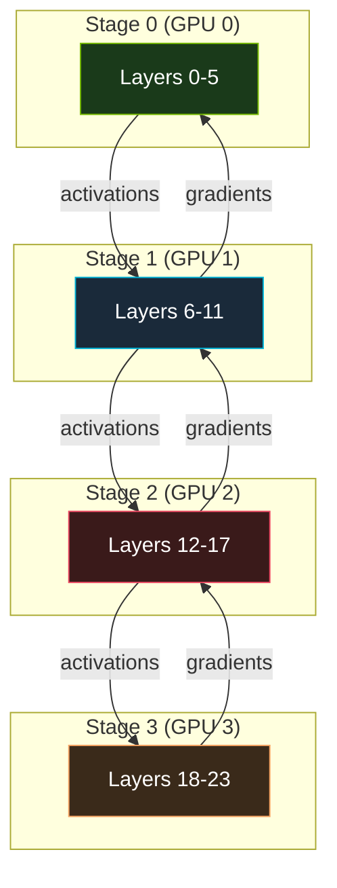
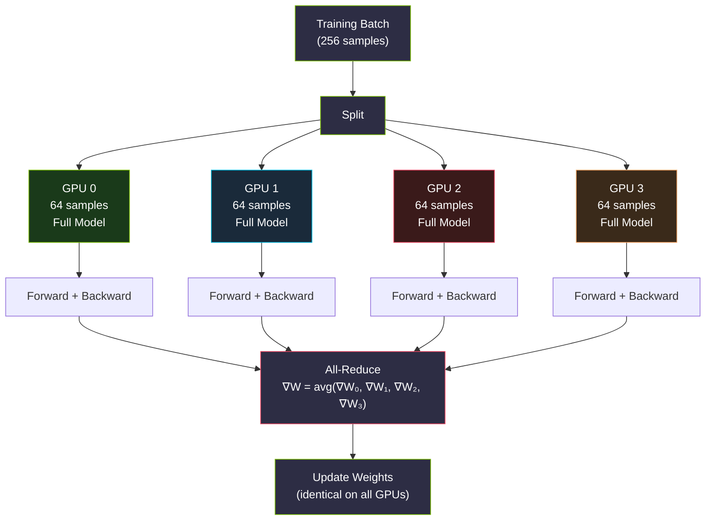
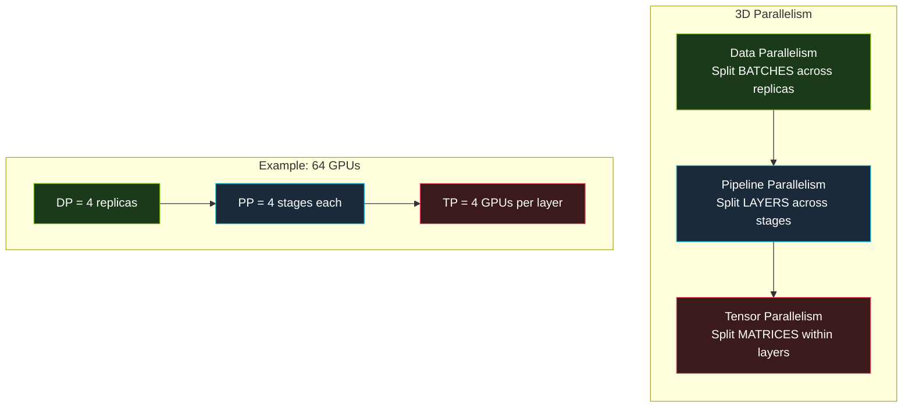
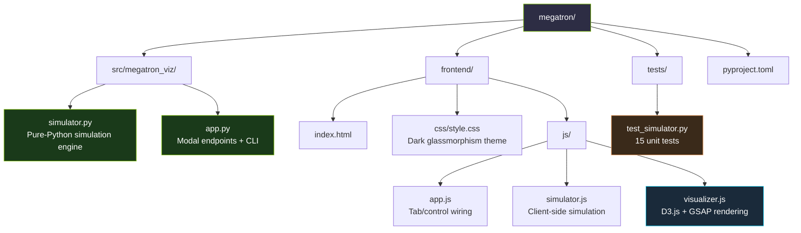

# Megatron Parallelism Visualizer

Interactive visualizer for NVIDIA Megatron-Core parallelism strategies — **Tensor, Pipeline, and Data Parallelism**.

Built to understand how large language models are distributed across GPUs during training.

## Architecture



## How Megatron Parallelism Works

### Tensor Parallelism (TP)

Splits individual **weight matrices** across GPUs. Each GPU computes a partial result, then they communicate to reconstruct the full output.



### Pipeline Parallelism (PP)

Distributes transformer **layers** across GPU stages. Uses micro-batch scheduling (1F1B) to minimize idle "bubble" time.



#### 1F1B Schedule

```mermaid
gantt
    title Pipeline 1F1B Schedule (4 stages, 6 micro-batches)
    dateFormat X
    axisFormat %s

    section Stage 0
    F0 :f00, 0, 1
    F1 :f01, 1, 2
    F2 :f02, 2, 3
    F3 :f03, 3, 4
    B0 :crit, b00, 4, 5
    B1 :crit, b01, 5, 6

    section Stage 1
    Bubble :done, bub10, 0, 1
    F0 :f10, 1, 2
    F1 :f11, 2, 3
    F2 :f12, 3, 4
    B0 :crit, b10, 5, 6
    B1 :crit, b11, 6, 7

    section Stage 2
    Bubble :done, bub20, 0, 2
    F0 :f20, 2, 3
    F1 :f21, 3, 4
    B0 :crit, b20, 6, 7
    B1 :crit, b21, 7, 8

    section Stage 3
    Bubble :done, bub30, 0, 3
    F0 :f30, 3, 4
    B0 :crit, b30, 7, 8
    B1 :crit, b31, 8, 9
```



### Data Parallelism (DP)

Each GPU holds a **full copy** of the model. The training batch is split evenly, and gradients are synchronized via All-Reduce.



### How They Combine in Megatron

In practice, Megatron uses **all three** simultaneously. This is called **3D parallelism**:



## Quick Start

```bash
# Prerequisites: uv (https://docs.astral.sh/uv/)
uv sync                        # Install all dependencies
open frontend/index.html       # Open the interactive visualizer
```

## Modal Commands

The project uses [Modal](https://modal.com) for serverless GPU compute. You need a Modal account and token (`uv run modal token set`).

### `uv run modal run src/megatron_viz/app.py`

Runs the **local entrypoint** (`main()` function). This executes the simulation locally on your machine and prints a rich CLI demo with tables and metrics. No GPU needed, no cloud costs — the simulator is pure Python.

### `uv run modal deploy src/megatron_viz/app.py`

Deploys the app to Modal's cloud. This creates **persistent HTTPS endpoints** that run on Modal's infrastructure. The CPU endpoints serve simulation data (cold start ~2s); the GPU endpoint runs real matrix operations on a T4 GPU (cold start ~30s).

### Cost Breakdown

| Command | What runs | Cost |
| --- | --- | --- |
| `modal run` | Local entrypoint only | **Free** (runs on your Mac) |
| `modal deploy` | Creates cloud endpoints | **Free** until called |
| CPU endpoints | Simulation on Modal CPU | ~$0.000014/sec (~free) |
| GPU benchmark | T4 GPU matmul timing | ~$0.59/hr ($30/mo free tier) |

> **Note:** Modal's starter tier gives you $30/month in free credits. The CPU simulation endpoints cost virtually nothing. Only the GPU benchmark endpoint consumes meaningful credits, and each call takes <1 second.

## Project Structure



## Development

```bash
# Lint
uv run ruff check src/ tests/

# Format
uv run ruff format src/ tests/

# Test
uv run pytest tests/ -v
```

## Tech Stack

| Component | Tool |
|-----------|------|
| Language | Python 3.13 |
| Package Manager | uv |
| GPU Compute | Modal (T4, starter tier) |
| Visualization | D3.js + GSAP |
| Linting | Ruff |
| Testing | pytest |
